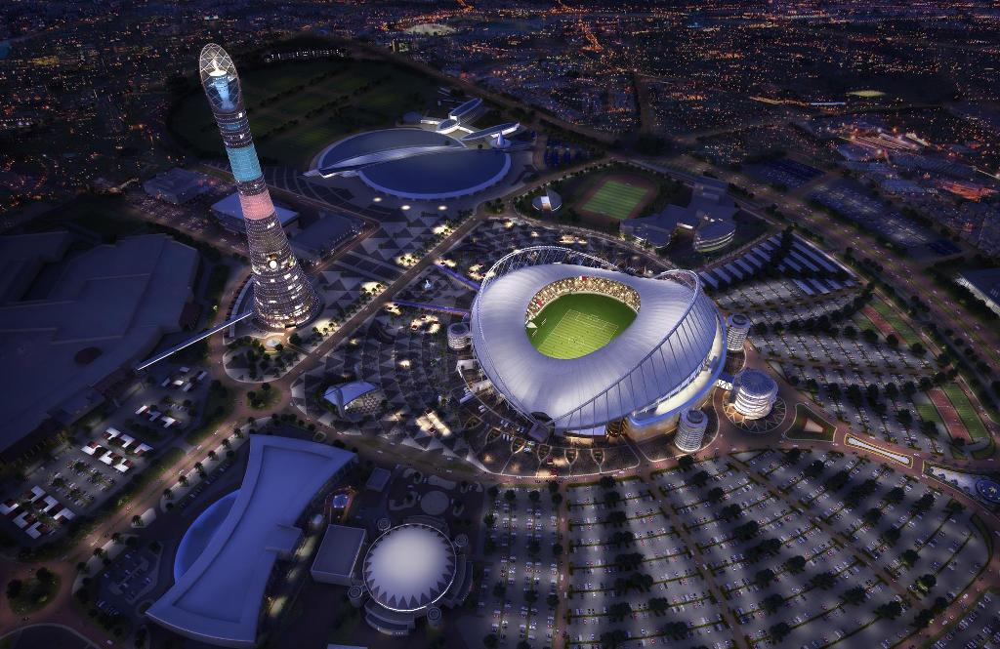

# О себе

## Учеба

    Зовут меня Александр или просто Алекс.
Все детство провел на севере, в Архангельской области. После школы решил переехать в Санкт-Петербург, для этого поступил в Балтийский Государственный Технический Университет "ВОЕНМЕХ" на специальность инженер (мехатроника). Успешно закочив, по специальности так и не пошел работать (это отдельная история).

## Работа

    Следущие 20 лет проработал в барах Петербурга. Славное было время

    И вот... Пришло время Нетологии и Инвестиций

## Увлечение

Мое хобби - спорт. Жду с нетерпением ЧМ - 22 по футболу в Катаре. К сожалению, Россию мы там не увидим по политическим причинам, которые все знают.
 
 # 
 